# Setup RobotStudio for simulation: 

http://wiki.ros.org/abb/Tutorials/RobotStudio   

 

## Install RobotStudio 

Download and install RobotStudio from: https://new.abb.com/products/robotics/robotstudio  

 

## Setup RobotStudio 

The following steps will set up a robot arm able to communicate with ROS in RobotStudio:  

1. Open RobotStudio by clicking on the icon that was placed on the desktop during installation.  
2. In the opening dialog, create an empty station.  
3. Select ABB library and pick the robot type you want to model.  
4. The robot is spawned. You can zoom (scroll wheel), move (CTRL+drag mouse) and rotate (CTRL+SHIFT+drag mouse).  
5. Select Robot System and choose From Layout...  
6. Give the system a name, leave the rest of the options untouched and press Next >.  
7. There should be only one mechanism, so just press Next >.  
8. Click Options... and select 616-1 PC interface and 623-1 Multitasking.  
9. Click Finish. 

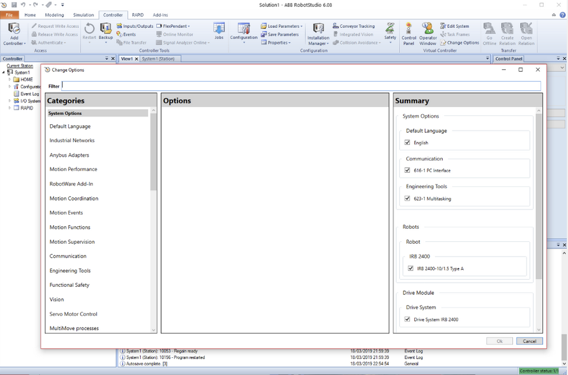

Click Change Options and search for 616-1 and 623-1 in order to add them

NOTE: I was not able to setup RobotStudio with the windows user jonas.hörnstein due to the ö... 

Install RAPID files 

Before continuing in RobotStudio, you need to put the RAPID files of the ROS driver on the controller of the created arm.  

1. Go to <documents_directory>\RobotStudio\Systems and select the folder corresponding to the name of your station.  
2. Open the HOME directory.  
3. Create a new directory called ROS. 
4. Copy all the files from: https://github.com/ros-industrial/abb/tree/indigo-devel/abb_driver/rapid and place them in the newly created ROS directory. 

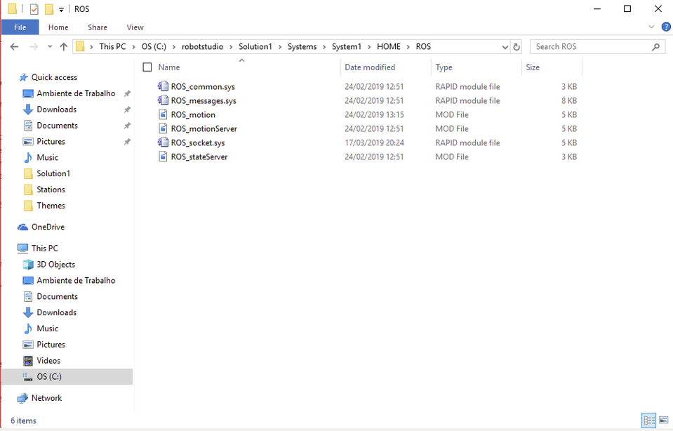

## Set IP number 

Open CMD and run ipconfig to check the IP of the computer: 

```
IPv4 Address. . . . . . . . . . . : 192.168.1.231 
```

Now open ROS_socket.sys and change the following line:  

```
IF (SocketGetStatus(server_socket) = SOCKET_CREATED) SocketBind server_socket, GetSysInfo(\LanIp), port;
```

into:  

```
IF (SocketGetStatus(server_socket) = SOCKET_CREATED) SocketBind server_socket, "192.168.1.231", port; 
```

## Install ROS-I Driver 

You are now ready to install the ROS-Industrial driver in RobotStudio:  

1. Select the tab controller and then FlexPendant. This is a simulated version of the FlexPendant on the real robot on which you need to install the driver.  
2. First go into MANUAL mode by selecting the button left from the joystick and turning the key in the upright position.  
3. You can now follow the installation instructions from the ABB [install server tutorial](http://wiki.ros.org/abb/Tutorials/InstallServer). 

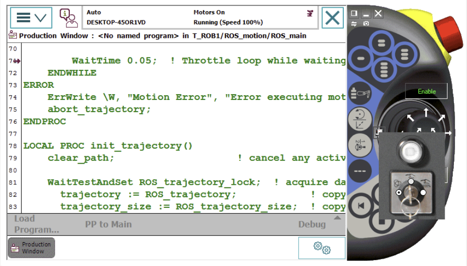

### Install ROS server 

http://wiki.ros.org/abb/Tutorials/InstallServer  


### Create Tasks 


NOTE: I had to change the Main Entry of T_ROB1 from main to ROS_main. The corresponding change had to be done in the file ROS_motion.mod 

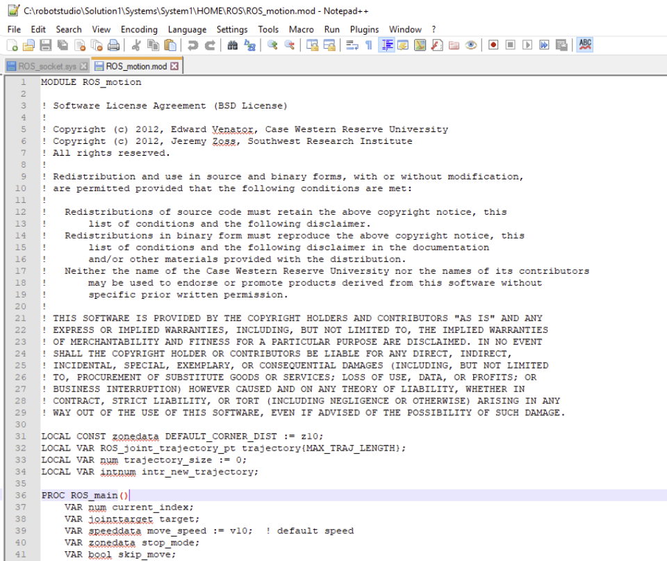

### Create Signals 

According instructions...

### Tie Signals to the System Outputs 

According instructions...

### Load Modules to Tasks 

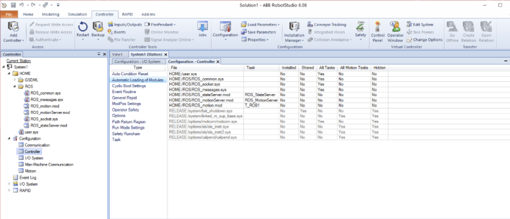


# Control a virtual ABB arm from ROS 

 

Open Robotstudio and bring up the FlexPendant 

Set FlexPendant to auto mode 

In RobotStudio, select control panel and Push Motor Button to activate motors 

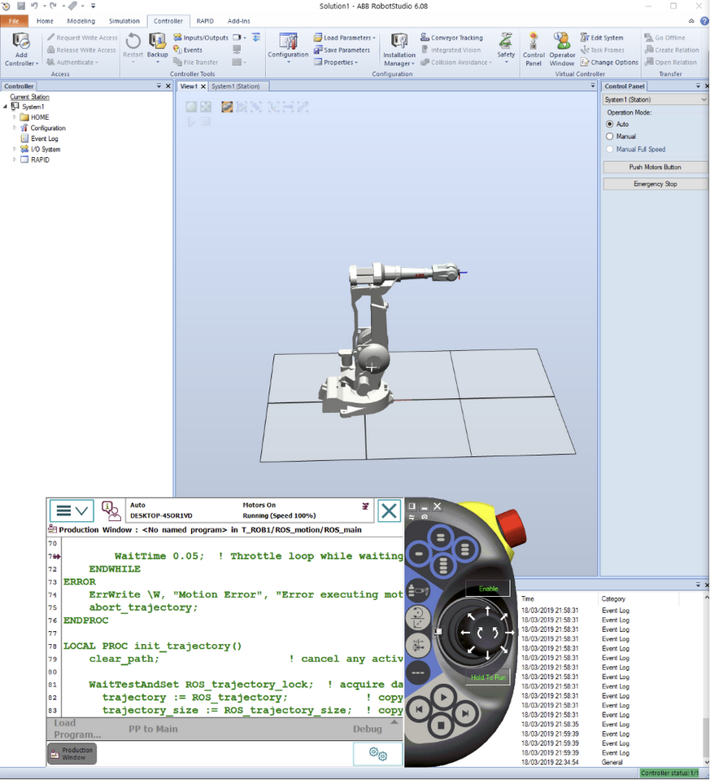

```
roslaunch abb_irb2400_support robot_interface_download_irb2400.launch robot_ip:=192.168.1.231
```

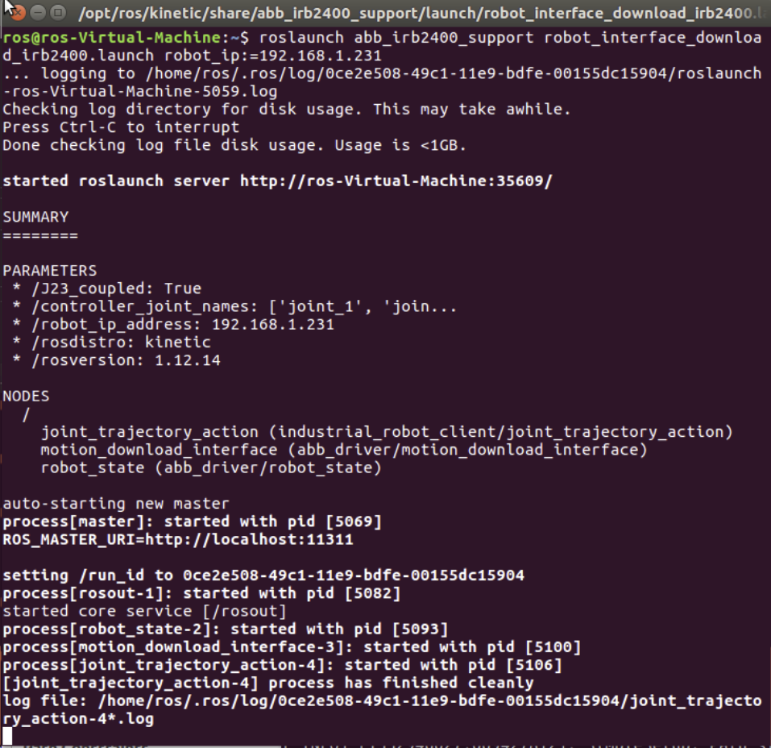

```
roslaunch abb_irb2400_moveit_config moveit_planning_execution.launch robot_ip:=192.168.1.231
```

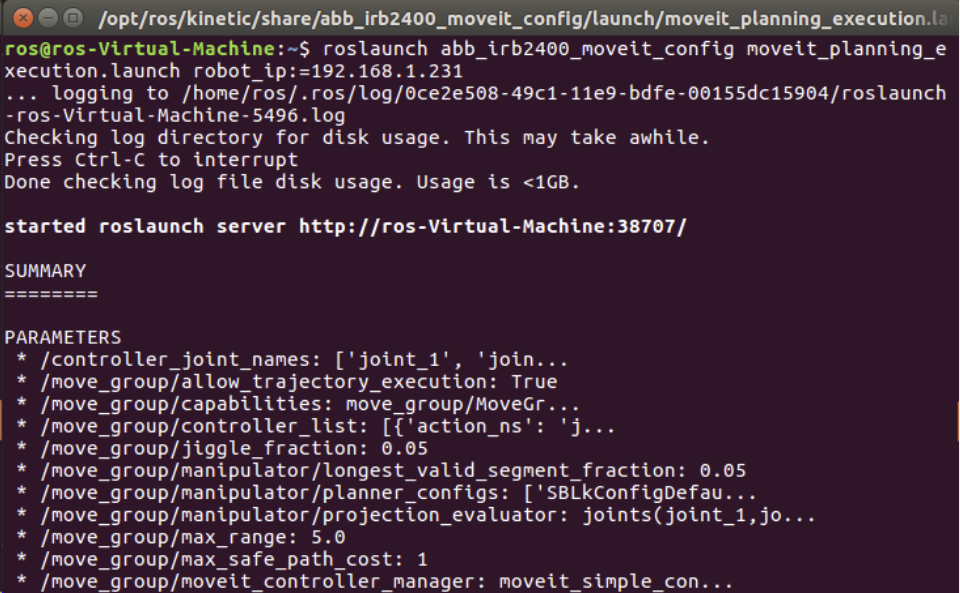

This brings up RViz with MoveIt: 

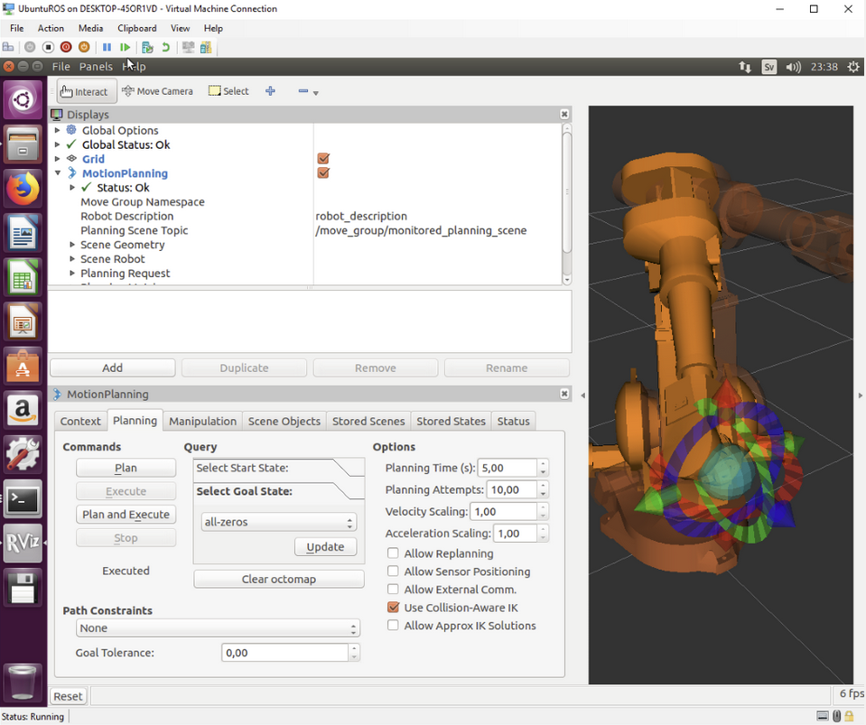

Move robot arm into new position and click Plan and Execute 

The arm in RobotStudio follows the trajectory planned in MoveIt: 

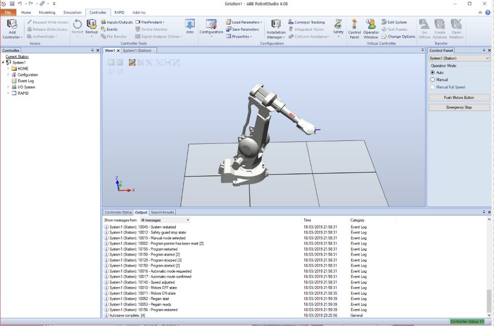


# Installing on robot 


To be able to install ROS on an ABB robot, the following options are needed:

- 616-1 PC interface 
- 623-1 Multitasking 

These requires RobotWare OS version 5.13 or later is required due to the use of certain socket options.

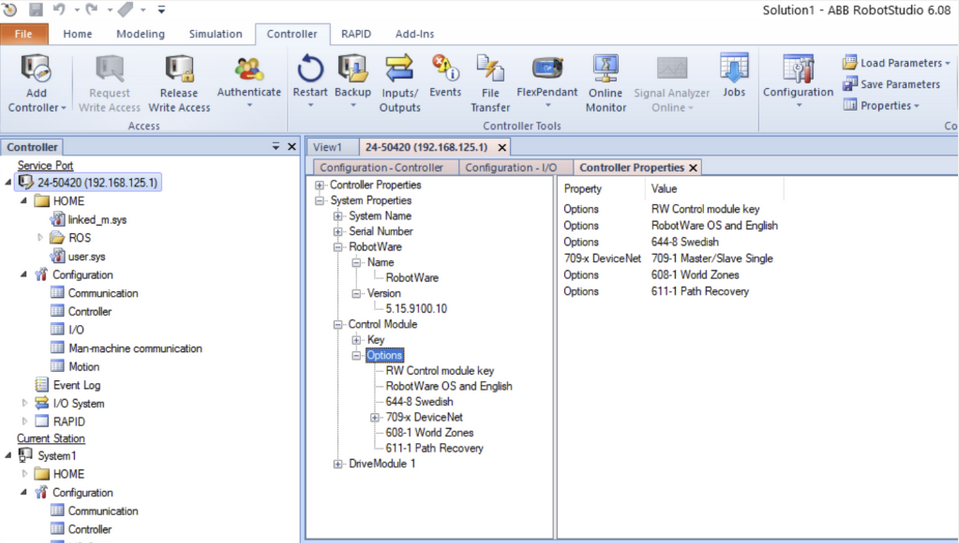

These are probably the steps needed (Page 175 in RobotStudio operating manual): 

Tab controller – click Installation Manager – select System Builder 

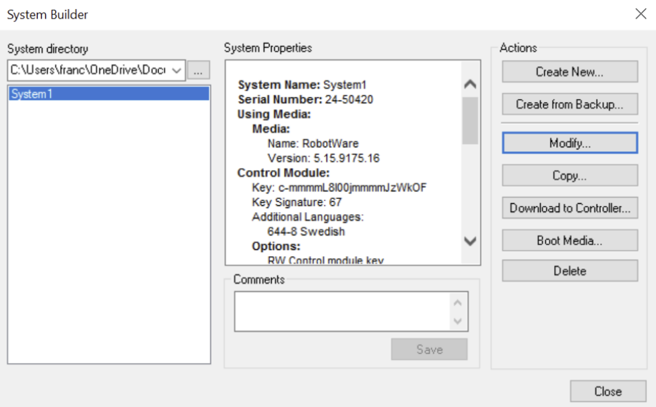

 
Click Modify to add needed controller options 

Click “Download to Controller” to send the system to the IRC5 controller using the service port. 


