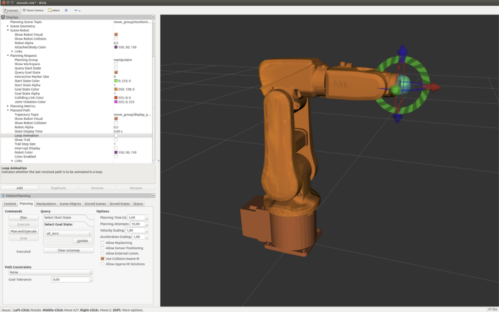
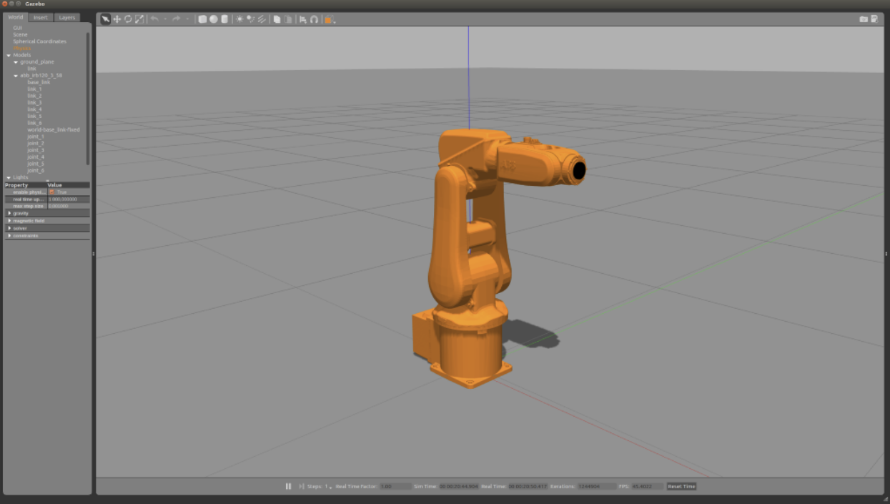
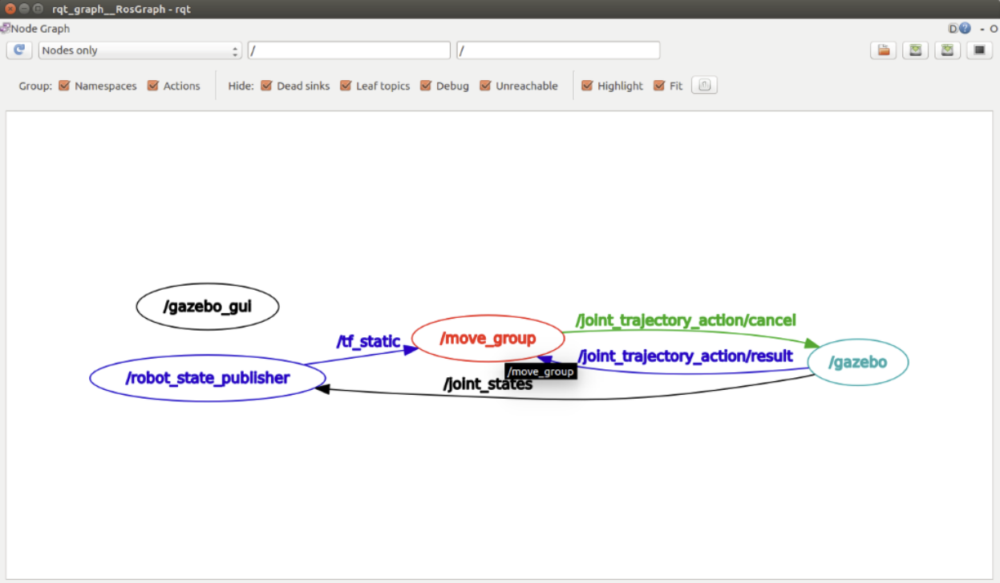

# Install  ROS

```
sudo sh -c 'echo "deb http://packages.ros.org/ros/ubuntu $(lsb_release -sc) main" > /etc/apt/sources.list.d/ros-latest.list' 

sudo apt-key adv --keyserver hkp://pool.sks-keyservers.net:80 --recv-key 421C365BD9FF1F717815A3895523BAEEB01FA116 

sudo apt-get update 

sudo apt-get install ros-kinetic-desktop-full 

sudo rosdep init 

rosdep update 

echo "source /opt/ros/kinetic/setup.bash" >> ~/.bashrc 

source ~/.bashrc 

sudo apt-get install python-rosinstall python-rosinstall-generator python-wstool build-essential 

mkdir -p ~/smarter_ws/src 

cd ~/smarter_ws/ 

catkin_make 

echo "source $HOME/smarter_ws/devel/setup.bash" >> ~/.bashrc 

source ~/.bashrc  

echo $ROS_PACKAGE_PATH
```


# Install MoveIt 

```
rosdep update 

sudo apt-get update 

sudo apt-get dist-upgrade 

sudo apt-get install ros-kinetic-catkin python-catkin-tools 

 

sudo apt install ros-kinetic-moveit 

mkdir -p ~/ws_moveit/src 

cd ~/ws_moveit/src 

git clone -b kinetic-devel https://github.com/ros-planning/moveit_tutorials.git 

git clone -b kinetic-devel https://github.com/ros-planning/panda_moveit_config.git 

 

cd ~/ws_moveit/src 

rosdep install -y --from-paths . --ignore-src --rosdistro kinetic 

cd ~/ws_moveit 

catkin config --extend /opt/ros/kinetic 

catkin build 

source ~/ws_moveit/devel/setup.bash 
```

# Install  ROS  industrial  ABB


```
sudo apt-get install ros-kinetic-industrial-core 

sudo apt-get install ros-kinetic-abb 

 

mkdir -p ~/ws_abb/src 

cd ws_abb/src/ 

git clone -b kinetic-devel https://github.com/ros-industrial/abb.git 

 

sudo apt install ros-kinetic-industrial-core ros-kinetic-moveit 

git clone -b kinetic-devel https://github.com/ros-industrial/abb_experimental.git 

wstool init . 

wstool merge abb_experimental/abb_experimental.rosinstall 

wstool update 

cd .. 

catkin build 

source devel/setup.bash  

catkin build 


sudo apt install ros-kinetic-ros-control 

sudo apt-get install ros-kinetic-gazebo-ros-pkgs ros-kinetic-gazebo-ros-control 

```


# Execute  Gazebo  simulation: 

```
roslaunch abb_irb120_gazebo irb120_3_58_gazebo.launch 

roslaunch abb_irb120_moveit_config moveit_planning_execution_gazebo.launch 
```







