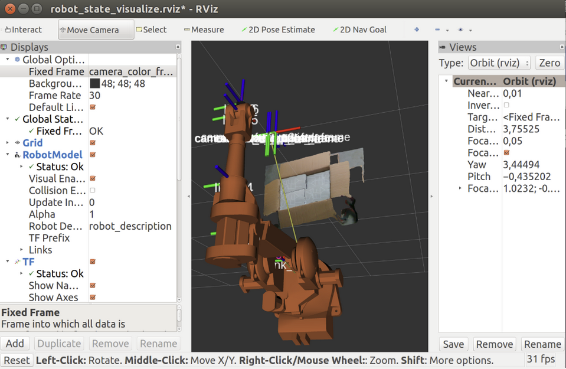

# Intel Realsense 

 

## Install: 

Realsense drivers and software: 

https://github.com/IntelRealSense/librealsense/blob/development/doc/distribution_linux.md  

ROS support: 

https://github.com/intel-ros/realsense  

 

## Record rosbag: 

Oper terminal with 3 tabs: 

Tab1: 

```
    cd catkin_ws/ 

    source devel/setup.bash 

    roslaunch realsense2_camera rs_camera.launch filters:=pointcloud 
```
 

Tab 2: 

```
    Rviz 
```
 

Tab 3: 

```
    rosbag record -O my_bagfile_1.bag /camera/color/image_raw /camera/depth/color/points /tf_static 
```
 

## Play rosbag 

Tab 1: 
```
    cd ws_abb/ 

    source devel/setup.bash  

    roslaunch abb_irb2400_support test_irb2400.launch 
```
 

Tab 2: 

```
    rosrun tf static_transform_publisher 1 0 1 0 1 0 1 /base_link /camera_link 100 
```
 

Tab 3: 

```
    rosbag play my_bagfile_1.bag 
```




## Extracting point cloud coordinates with Python: 

```
for p in pc2.read_points(point_cloud, field_names = ("x", "y", "z"), skip_nans=True):      
    print " x : %f  y: %f  z: %f" %(p[0],p[1],p[2]) 
```
 

Extracting points and converting to PCL: 

https://www.programcreek.com/python/example/99841/sensor_msgs.msg.PointCloud2  

https://github.com/jupidity/PCL-ROS-cluster-Segmentation/blob/master/scripts/pcl_helper.py  


